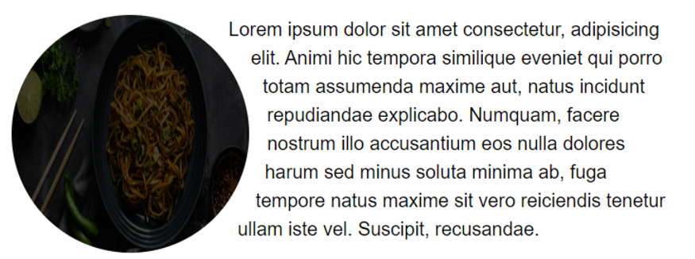

# CSS nima ?

- CSS (Cascading Style Sheets) – bu veb-sahifalarning ko'rinishini boshqaruvchi stil tili. HTML yoki boshqa markup tillari bilan birgalikda ishlatiladi, CSS sahifadagi elementlarning vizual ko'rinishini belgilashga imkon beradi.
- Yani html code larga dizayn berish va har hil animatysiyalar qilishda yordam beradi.

### CSS'ning paydo bo'lishi:

- CSS birinchi marta 1994-yilda Håkon Wium Lie tomonidan taklif qilingan. U shu paytda CERN da, Tim Berners-Lee bilan birga ishlayotgan edi.
- CSS ning asosiy g'oyasi HTML dan ko'rinishni ajratish va bir nechta HTML hujjatlar uchun bitta stil varaqasidan foydalanish imkoniyatini berish edi.

### CSS1:

- Chiqish sanasi: 1996-yil, dekabr.
- Tavsif: CSS1 — bu CSS ning birinchi versiyasi bo'lib, uning maqsadi HTML elementlarini stilizatsiya qilish imkoniyatini yaratish edi. CSS1 o'z ichiga ranglar, shriftlar, oraliq masofalar va uslublar qo'llash kabi asosiy xususiyatlarni kiritdi.

### CSS4:

- Chiqish sanasi: CSS4 hali to'liq rasmiylashtirilmagan va rivojlanayotgan bosqichda.

## CSS syntax


## CSS selectors

- <span style="color: orange;"> #id</span>
- <span style="color: orange;"> .class
  </span>
- <span style="color: orange;"> \*
  </span>
- <span style="color: orange;"> element
  </span>
- <span style="color: orange;"> element,element,…
  </span>

## CSS properties

<span style="color: green; font-weight:bold;"> box-reflect
</span>

> `below, above, left , right` 

<span style="color: green; font-weight:bold;">mix-blend-mode
</span>

> `difference` - bu value orqali elementimizni background qandayligiga qarab color change bo’ladi ya’ni orqa fon oq bolsa color qora bo’ladi.

```css
mix-blend-mode: normal;
mix-blend-mode: multiply;
mix-blend-mode: screen;
mix-blend-mode: overlay;
mix-blend-mode: darken;
mix-blend-mode: lighten;
mix-blend-mode: color-dodge;
mix-blend-mode: color-burn;
mix-blend-mode: hard-light;
mix-blend-mode: soft-light;
mix-blend-mode: difference;
mix-blend-mode: exclusion;
mix-blend-mode: hue;
mix-blend-mode: saturation;
mix-blend-mode: color;
mix-blend-mode: luminosity;
mix-blend-mode: plus-darker;
mix-blend-mode: plus-lighter;
```

<span style="color: green; font-weight:bold;">background-blend-mode
</span>

> ```css
> background-image: url('./table.jpg'), url('./canon.jfif');
> background-blend-mode: overlay;
> ```
>
>  

> 

<span style="color: green; font-weight:bold;">shape-outside
</span>

> shape-outside CSS xususiyati elementning matn o'ralgan shaklini belgilash uchun ishlatiladi. Bu, asosan, matnning qanday qilib element atrofida joylashishini aniqlashda foydalidir, xususan, suratlar yoki boshqa shakllar bilan ishlashda.
> 

<span style="color: green; font-weight:bold;">mask-image
</span>


# CSS functions

<span style="color: green; font-weight:bold;"> oklch() va oklab()
</span>

> **oklch()** funksiyasi rangni Oklab rang modeliga asosan tavsiflaydi. Oklab rang modeli rangni oqim (L\*), qizil-yashil (a\*), va sariq-ko'k (b\*) koordinatalarida tasvirlaydi. Bu rang modeli ranglarni ko'rish va moslashtirishni aniqroq qilish uchun mo'ljallangan.

- **l**: Oqlab rangining yorqinlik qiymati (0 dan 1 oralig'ida).
- **a**: Qizil-yashil komponenti (odatda -1 dan +1 gacha).
- **b**: Sariq-ko'k komponenti (odatda -1 dan +1 gacha).
- **alpha** _(ixtiyoriy)_: Rangning shaffoflik darajasi (0 dan 1 gacha).

**oklab()** funksiyasi rangni Oklab rang modeliga asosan ko'rsatadi, ammo u rangni formatda tasvirlaydi. **oklab()** rang modelida ranglar ko'proq aniqroq va zamonaviy tarzda ko'rsatiladi.

- **L**: Rangning yorqinlik darajasi (0 dan 1 gacha).
- **a**: Qizil-yashil komponenti (odatda -1 dan +1 gacha).
- **b**: Sariq-ko'k komponenti (odatda -1 dan +1 gacha).

<span style="color: green; font-weight:bold;">
Override Global Variable With Local Variable
</span>


