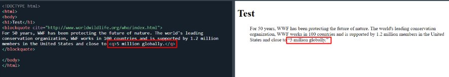

## HTML nima ?

- HTML (HyperText Markup Language)
- HTML asoschisi fizik Tim Berners-Li , bo’lib 1989 yilda internetga asoslangan gipermatn tizimini yozgan.
- HTML veb-sahifalarni yaratish uchun standart belgilash tilidir
- HTML Web-sahifaning tuzilishini tavsiflaydi
- HTML bir qator elementlardan iborat
- HTML elementlari brauzerga kontentni qanday ko'rsatishni aytadi
- HTML elementlari "bu sarlavha", "bu paragraf", "bu havola" va boshqalar kabi kontent qismlarini belgilaydi.

### HTML Sematics

Sematika bu html o’zi belgilab bergan qonun qoida va taglarni ketmaketligi tag structure.


## DOCTYPE

Sematika bu html o’zi belgilab bergan qonun qoida va taglarni ketmaketligi tag structure.

- Buni qo’yish required hisoblanadi codeni birinchi qatoriga qo’yiladi.
- Standartlar rejimi: Doctype brauzerga sahifani standartlarga mos ravishda ko'rsatishni buyuradi. Agar Doctype noto'g'ri yoki kiritilmagan bo'lsa, ba'zi brauzerlar "quirks mode" deb ataladigan xatti-harakatlarga o'tadi, bu eski veb-sahifalarni ko'rsatish usuli.
- Qaror qabul qilish jarayonini soddalashtirish: Zamonaviy HTML5 doctype yozuvi juda sodda bo'lib, yangi hujjatlarni yaratishda xatolar qilish imkoniyatini kamaytiradi.
  -Quirks Mode — bu brauzerlarning eski, standartlarga mos kelmaydigan veb-sahifalarni to'g'ri ko'rsatish uchun ishlatadigan maxsus rejimi. Bu rejimda brauzerlar veb-sahifalarni hozirgi zamonaviy HTML va CSS standartlariga mos ravishda emas, balki 1990-yillarning oxiri va 2000-yillarning boshlaridagi eski, noto'g'ri yoki noto'liq kodlarni qo'llab-quvvatlash uchun ishlaydi.

## Tags

1. HTML taglardan iborat taglar esa 2 ga bo’linadi juft va toq.
2. Misol uchun toq tegalr br, hr…, shular bo’lsa juft taglar title, header, nav… shulardan iborat
3. `<menu>` = `<ul>`
4. `<html lang="en">`
   > lang="en" atributi sahifadagi matnning tilini belgilaydi. Bu yerda en qiymati ingliz tilini anglatadi. Bu atribut SEO (qidiruv tizimlari optimizatsiyasi) va yordamchi texnologiyalar (masalan, ekran o‘qish dasturlari) uchun foydali.
5. `<meta name="viewport" content="width=device-width, initial-scale=1.0" />`

   > Bu meta tegi mobil qurilmalarda sahifaning to‘g‘ri ko‘rinishini ta'minlash uchun ishlatiladi. content="width=device-width, initial-scale=1.0" qiymati sahifaning kengligini qurilma ekranining kengligiga moslashishini va dastlabki kattalashtirish darajasini belgilaydi. Bu responsiv dizaynni qo‘llab-quvvatlaydi.

6. `<head>`
   > meta ma’lumotlarini o’z ichiga oladi. head qismidagi ma'lumotlar foydalanuvchiga ko‘rinmaydi, lekin brauzer va qidiruv tizimlari tomonidan ishlatiladi.
7. `<meta charset="UTF-8" >`

   > `meta` tegining charset="UTF-8" atributi HTML hujjatining belgilar to‘plamini belgilaydi. UTF-8 belgilar to‘plami turli tillarda va yozuv tizimlarida keng qo‘llaniladi. Bu hujjatning to‘g‘ri kodlash va ko‘rsatishni ta'minlaydi.

8. `<abbr>`

   > bu tag TATU, BMT shunday qisqartmalar uchun ishlatiladi

   <!-- >  -->

   ```html
   <p>The <abbr title="World Health Organization">WHO</abbr> tag</p>
   ```

9. `<map>, <area>`

   > bu orqali biz imgni coords orqali belgilab olamiz va shuni click qilgan paytda qandaydir amal bajarishimiz mumkin bo’ladi
   > 

10. `<blockquote>, <q>`

    > Teg `blockquote` boshqa manbadan olingan bo'limni belgilaydi.
    > 

11. `<code>, <samp>, <kbd>`
    > Bu teglar kompyuter kodining bir qismini aniqlash uchun ishlatiladi. Ichkaridagi tarkib brauzerning standart monospace shriftida ko'rsatiladi.
    > 
12. `<em>, <i>, <cite>, <dfn>`

- Teg `em` urg'u berilgan matnni aniqlash uchun ishlatiladi
- Teg `i` ko'pincha texnik atama, boshqa tildagi ibora, fikr, kema nomi va boshqalarni ko'rsatish uchun ishlatiladi.
- Teg `cite` ijodiy ishning nomini belgilaydi (masalan, kitob, she'r, qo'shiq, kino, rasm, haykal va boshqalar).
- Teg `dfn` "ta'rif elementi" degan ma'noni anglatadi va u tarkibda aniqlanishi kerak bo'lgan atamani belgilaydi.

13. `<bdo>`
    > Teg bdo joriy matn yo'nalishini bekor qilish uchun ishlatiladi. Shuning uchun ichidagi matn boshqa yo'nalishda ko'rsatiladi. dir ltr rtl matn yo’nalishini aniqlaydi
14. `<dl>, <dt>, <dd>`

- Teg `dd` tavsiflar ro'yxatidagi atama/ismni tasvirlash uchun ishlatiladi.
- Teg `dl` (ta'riflar ro'yxatini belgilaydi) va dt (atamalarni/ismlarni belgilaydi) `dd` bilan birgalikda ishlatiladi.
- Teg ichiga `dd` paragraflar, qatorlar, rasmlar, havolalar, ro'yxatlar va boshqalarni qo'yishingiz mumkin.
  > 

15. `<details>`

    > Teg details ko'pincha foydalanuvchi ochishi va yopishi mumkin bo'lgan interaktiv vidjet yaratish uchun ishlatiladi. Odatiy bo'lib, vidjet yopiq. Ochiq bo'lsa, u kengayadi va ichidagi tarkibni ko'rsatadi. Tafsilotlar uchun ko'rinadigan sarlavhani belgilash uchun summary tegi bilan birgalikda ishlatiladi
    > 

16. `<meter>, <progress>`
    > Foizlar bilan ishlashda qo’l keladi.
    > 
17. `<optgroup>`
    > Teg select elementida (ochiladigan ro'yxat) optgroup tegishli variantlarni guruhlash uchun ishlatiladi.
    > 
18. `<picture>`

    > bu orqali biz ekranni size orqali yani css mediaquery bilan oxash necha px dan keyn qaysi rasm ko’rinishini belgilash mumkin
    > 

19. `<wbr>`

    > (Word Break Opportunity) tegi wbr matnning qaysi joyiga satr uzilishini qoʻshish mumkinligini koʻrsatadi.
    > 

20. `<canvas>`
    > Bu teg orqali har hil diagramma chart hatto o’yinlar ham yaratish mumkin. Buni o’zini alohida soha sifatida qaralsa ham bo’ladi. Misol uchun: [Bruno simon](https://bruno-simon.com/)
21. ARIA attribute

    > ARIA (Accessible Rich Internet Applications) atributlari veb-saytlarning foydalanuvchanligini yaxshilash uchun ishlatiladigan maxsus HTML atributlardir. Bu atributlar yordamida veb-elementlar ekranni o'qiydigan dasturlar va boshqa yordamchi texnologiyalar tomonidan tushunarli bo'ladi. ARIA atributlari asosan ko'rish qobiliyati cheklangan foydalanuvchilar uchun interaktiv veb-kontentni tushunarli qilish uchun mo'ljallangan.

    - Role (Rol) Atributi: Elementning turini yoki vazifasini bildiradi.
      - Misol: `role="button"` bu elementni tugma deb belgilaydi.
    - State (Holat) Atributlari: Elementning hozirgi holatini bildiradi.
      - Misol: `aria-checked="true`" bu elementning tanlanganligini bildiradi.
    - Property (Xususiyat) Atributlari: Elementning doimiy yoki o'zgaruvchan xususiyatlarini belgilaydi.
      - Misol: `aria-label="Menu"` bu elementning menyu ekanligini bildiradi.
    - Live Region (Jonli Hudud) Atributlari: Elementda ma'lumotlar dinamik tarzda yangilangan paytda foydalanuvchiga bildirish uchun ishlatiladi.
      - Misol: `aria-live="polite"` bu elementdagi o'zgarishlar ekranni o'qiydigan dastur tomonidan bildiriladi.
    - Relationship (Aloqa) Atributlari: Elementlarning bir-biri bilan qanday bog'liqligini bildiradi.
      - Misol: `aria-labelledby="label-id"` bu element qaysi yorliq bilan bog'liqligini ko'rsatadi.
    - Widget Atributlari: Interaktiv komponentlar uchun mo'ljallangan.
      - Misol: aria-expanded="false" bu element hozircha kengaytirilmaganligini bildiradi.
