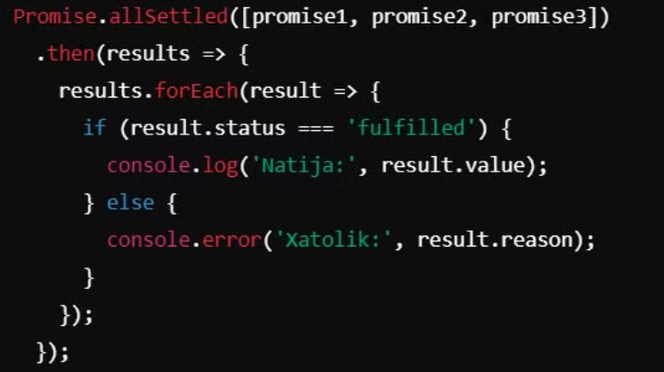

# JavaScript nima?

JavaScript — bu dinamik, ko‘p paradigmalı, keng qo‘llaniladigan dasturlash tili. U asosan veb-ilovalarni rivojlantirishda ishlatiladi, lekin server tomonida ham, mobil, ish stoli ilovalari va o‘yinlarni yaratishda ham qo‘llaniladi. JavaScriptni to‘liq tushunish uchun uni turli jihatlar bo‘yicha ko‘rib chiqish muhim.

## 1. JavaScript tarixi

JavaScript dasturlash tili Netscape kompaniyasining xodimi Brendan Eich tomonidan 1995-yilda yaratildi. U dastlab "Mocha", keyin "LiveScript", oxirida esa "JavaScript" deb nomlandi. Boshida Java tiliga o‘xshash ko‘rinar edi, lekin o‘zida farqli va soddalashtirilgan funksiyalarni jamlagan edi. JavaScript hozirgi kunda **ECMAScript** standarti asosida rivojlanmoqda.

**ECMAScript (ES)** — bu JavaScript dasturlash tilining standartidir. ECMAScript standarti JavaScript tilining sintaksisi, semantikasini va asosiy xususiyatlarini aniqlaydi. U xalqaro standartlar tashkiloti Ecma International tomonidan ishlab chiqiladi va kengaytiriladi.

## 2. JavaScriptning qo‘llanish sohalari

JavaScript dastlab faqat veb-brauzerlar ichida ishlatilardi. Hozirda esa quyidagi sohalarda keng qo‘llanilmoqda:

- **Veb-ilovalar**: JavaScript asosan front-end rivojlantirishda ishlatiladi.
- **Server tomonida**: Node.js bilan JavaScript server tomonida ishlatila boshladi.
- **Mobil ilovalar**: React Native, Ionic kabi freymvorklar orqali JavaScript mobil ilovalarda ham ishlatilmoqda.
- **Ish stoli ilovalari**: Electron kabi vositalar yordamida JavaScript bilan kross-platformali ilovalar yaratish mumkin.
- **O‘yinlar**: Phaser, Three.js kabi kutubxonalar orqali oddiy va murakkab o‘yinlar yaratish mumkin.

## 3. Ma'lumot turlari (Data Types)

JavaScriptda ma'lumotlar turi dinamik bo‘lib, quyidagi asosiy turlarga ega:

### Primitive Types:

- **String**: `"Salom"`
- **Number**: `123`
- **Boolean**: `true`, `false`
- **null**: Ma'lum bo‘lmagan qiymat.
- **undefined**: Qiymat berilmagan.
- **Symbol**: Yagona qiymatlarni ifodalovchi tur.

### Object (Obyektlar):

Obyektlar kalit-qiymat juftlari sifatida ishlatiladi:  
`{ name: "Test", age: 25 }`.

## async/await

### Async/Await'ning asosiy tushunchalari:

#### 1. Async funksiyalar

`async` kalit so‘zi yordamida funksiyalar asenkron deb belgilanadi. Bu funksiya har doim **Promise** qaytaradi, va undagi qiymatni olish uchun `await` kalit so‘zi ishlatiladi. Agar funksiya oddiy qiymat qaytaradigan bo‘lsa, u avtomatik ravishda **resolved Promise**ga o‘raladi.

#### 2. Await kalit so‘zi

`await` kalit so‘zi faqat `async` funksiyalar ichida ishlaydi. U **Promise** hal bo‘lguncha kutadi va resolved bo‘lgan qiymatni qaytaradi. `await` ishlatilgan joyda kod kutish holatiga o'tadi va shu nuqtada JavaScript o‘zining event loop jarayonini davom ettiradi.

## Foydalari va afzalliklari:

- **Ko‘rinishi sinxron kabi**: `async/await` yordamida kod sinxron ko‘rinadi, lekin asenkron ishlaydi. Bu kodni osonroq o‘qish va tushunish imkonini beradi.
- **Promise chaining'dan saqlanish**: Agar Promise bilan ishlasangiz, zanjirlangan `.then()` metodlaridan foydalanish kerak bo‘ladi. Bu esa uzun va murakkab kodga olib kelishi mumkin. `async/await` buni soddalashtiradi.
- **Xato bilan ishlashni yaxshilaydi**: Promise'dagi `.catch()` blokidan farqli ravishda, `try/catch` bloklari orqali xatolarni qo‘lga olish ancha tushunarli va intuitiv bo‘ladi.

## Promise

JavaScript 2015 yil (ES6) yangilanishida **Promise** ob'ekti joriy etildi.

### Promise Holatlari:

- **Pending**: Promise hali bajarilmagan va natija yoki xatolik hali mavjud emas.
- **Fulfilled**: Promise muvaffaqiyatli bajarilgan va `resolve` chaqirilgan.
- **Rejected**: Promise bajarilmagan va `reject` chaqirilgan.

**Promise** JavaScript dasturlash tilida asinxron operatsiyalarni boshqarish va ularning natijalarini ishlash uchun ishlatiladigan kuchli vositadir. Promise obyektlari asinxron operatsiya tugagandan so'ng ma'lumotlarni qaytarish yoki xatolikni bildirishi mumkin.

Promise obyekti yaratishda, asinxron operatsiyani amalga oshiruvchi funksiya (**executor funksiyasi**) beriladi. Bu funksiya ikkita argumentni qabul qiladi: `resolve` va `reject` funksiyalari.

### then, catch va finally Metodlari:

- **then(onFulfilled, onRejected)** — bu metod Promise muvaffaqiyatli bajarilganda (`resolve` chaqirilganda) yoki xatolik yuz berilganda (`reject` chaqirilganda) qo‘llaniladigan funksiyalarni qabul qiladi.
- **catch(onRejected)** — xatoliklar uchun alohida metod bo‘lib, Promise xato bilan tugaganida chaqiriladi.
- **finally** — Promise bajarilgandan so'ng, muvaffaqiyatli yoki xatolik bilan tugaganidan qat'i nazar, bajariladi.

### Parallel Asinxron Operatsiyalar

- **Promise.all(promises)** — bir nechta Promise obyekti to‘plamini oladi va barcha Promiselar muvaffaqiyatli bajarilsa, `resolve` bo‘ladi, aks holda `reject` chaqiriladi.

### allSettled

- **Promise.allSettled(promises)** — barcha Promiselar muvaffaqiyatli yoki xatolik bilan tugagandan so‘ng, `fulfilled` yoki `rejected` holatida qaytaradi.

### race

- **Promise.race(promises)** — eng birinchi bajarilgan Promisening natijasini qaytaradi.

### any

- **Promise.any(promises)** — barcha Promiselar `reject` bo'lsa, `AggregateError`ni qaytaradi, aks holda birinchi muvaffaqiyatli natijani qaytaradi.

## yield

JavaScript'da `yield` kalit so'zi generator funksiyalar bilan ishlash uchun mo'ljallangan. `yield` yordamida generatorlar qiymatlarni ketma-ket ravishda qaytarishi mumkin va generator funksiyalarining bajarilishini to'xtatib, keyin qayta davom ettirish imkonini beradi.

### Generator

#### Generator Funksiyalar:

- Generator funksiyalar `function*` sintaksisi bilan yaratiladi. `*` belgisining mavjudligi bu funksiyaning generator funksiyasi ekanligini bildiradi.
- Generator funksiyalari `yield` kalit so'zini ishlatib, to'xtatish nuqtalarini belgilashga imkon beradi va `yield` orqali qiymatlarni qaytaradi.
- Generatorlar iterator sifatida ishlaydi, bu esa ularni `for-of` loop yoki `forEach` kabi iteratorlarni qo'llab-quvvatlaydigan strukturalarda ishlatishga imkon beradi.

### yield

- **yield** qiymatlarni generatordan tashqariga qaytarish uchun ishlatiladi. Har safar `next()` metodini chaqirganda, generator `yield` qatorida to'xtaydi va qiymat qaytaradi.
- **yield** generator funksiyasining bajarilishini vaqtincha to'xtatadi va keyin qayta davom ettirishi mumkin. Boshqa qiymatlarni `yield` yordamida qaytarish va generator funksiyasining holatini saqlash mumkin.

### yield\*

- **yield\*** sintaksisi boshqa generator funksiyalarini yoki iterativ obyektlarni generator ichida chaqirish uchun ishlatiladi. Bu orqali ichki generatorlardan yoki iteratorlardan qiymatlarni olish mumkin.

## Asinxron Generatorlar

- **ES2018 (ES9)** da asinxron generatorlar joriy etildi. Bu generatorlar `async function*` sintaksisi bilan yaratiladi va `await` kalit so'zi yordamida asinxron qiymatlarni qaytarishi mumkin.
- Asinxron generatorlar `for-await-of` loop yordamida iteratsiya qilinadi va ular asinxron iterativ obyektlar bilan ishlash imkonini beradi.

