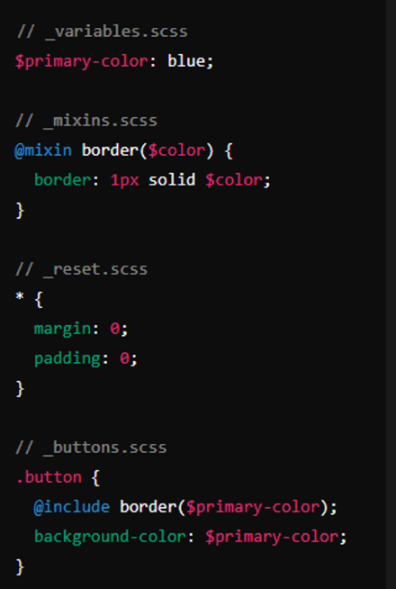

# SASS

## SASS nima?

Sass (Syntactically Awesome Style Sheets) - bu CSS uchun preprocesser bo'lib, u CSS yozishni osonlashtiradi va kuchliroq qiladi. Sass dastlab ishlab chiqarilgan CSS sintaksisini kengaytirish uchun ishlatiladi va qo'shimcha xususiyatlar, sintaksis qisqartmalari, va qayta foydalanish imkoniyatlarini taqdim etadi.

- **Chiqish sanasi:** 2006-yil
- **Sintaksis:**
  - **Sass:** Indentsiya asosida, CSS'ga o'xshash bo'lmagan sintaksis.
  - **SCSS:** CSS'ga o'xshash sintaksis, CSS kodini o'z ichiga oladi va Sass funksiyalarini qo'llab-quvvatlaydi.
- **Asosiy Xususiyatlar:** O'zgaruvchilar, mixins, nesting, meros, matematik amallar, modullar (partials).

## SASS vs SCSS

### Sass (Indentation Syntax)

- **Sintaksis:** Sass o'zining o'ziga xos sintaksisiga ega bo'lib, unda qavslar `{}` va nuqta-vergul `;` ishlatilmaydi. Buning o'rniga, u Python kabi ichki ko'rinishni belgilash uchun indentatsiya (bo'sh joy yoki tab) ishlatadi.
- **Chidamlilik:** Sass sintaksisi CSS-dan ancha qisqa va o'qish osonroq bo'lishi mumkin, chunki ortiqcha belgilashlardan qochadi.
- **Fayl kengaytmasi:** Sass sintaksisidagi fayllar `.sass` kengaytmasi bilan tugaydi.

### SCSS (Sassy CSS)

- **Sintaksis:** SCSS odatiy CSS bilan to‘liq mos keladigan sintaksisga ega. U qavslar `{}`, nuqta-vergullar `;`, va boshqa CSS qoidalarini o'z ichiga oladi, lekin Sass imkoniyatlarini kengaytirish va kuchaytirish uchun ishlatiladi.
- **Oson o‘tish:** CSS-dan SCSS-ga o'tish juda oson, chunki SCSS odatdagi CSS qoidalarini qabul qiladi. Bu SCSS-ni CSS biladigan, lekin Sass o'rganmoqchi bo'lganlar uchun afzal qiladi.
- **Fayl kengaytmasi:** SCSS sintaksisidagi fayllar `.scss` kengaytmasi bilan tugaydi.
- **Muammo:** [#216](https://github.com/sass/sass/issues/216)

## 7-1 pattern

- **base/**: Loyihaning asosiy (fundamental) qismlari, global CSS kodlari shu yerda joylashadi. Bu joyda `reset`, `typography`, `fonts`, `variables` kabi fayllar bo'lishi mumkin.
- **components/**: Loyihaning kichik, qayta ishlatiladigan komponentlari. Masalan, `buttons`, `cards`, `dropdowns` kabi elementlar.
- **layout/**: Loyiha tuzilmasini boshqaradigan fayllar. Masalan, `header`, `footer`, `grid`, `navigation` kabi strukturalar bu yerda joylashadi.
- **pages/**: Alohida sahifalar uchun stil qoidalari. Masalan, `home`, `about`, `contact` kabi sahifalarga xos stylinglar bu yerda bo'lishi mumkin.
- **themes/**: Agar loyiha bir nechta rangli mavzularni (themes) qo'llab-quvvatlasa, ularni shu yerda boshqarish mumkin.
- **abstracts/**: Bu yerda `mixin`, `function`, `variables` kabi utilitlar bo'ladi. Bu papka ba'zan `helpers` yoki `utils` deb ham ataladi.
- **vendors/**: Uchinchi tomon kutubxonalari yoki frameworklar uchun stil kodlari. Masalan, `bootstrap`, `jquery-ui` kabi CSS kutubxonalari.
- **main.scss**: Bu fayl loyihaning barcha fayllarini bir joyda jamlaydi (`@import` orqali). Bu fayl odatda asosiy stil fayli bo'lib, loyiha oxirida ishlab chiqarish uchun kompilyatsiya qilinadi.


### @import

- **Sass-da `@import` CSS-dagi `@import` dan farq qiladi.** Sass-da u boshqa Sass fayllarini bitta asosiy faylga birlashtirish uchun ishlatiladi.
- Misollar:
  ```scss
  @import 'variables';
  @import 'mixins';
  @import 'base';
  ```

### @use

- **`@use` sizga fayllarni import qilish imkonini beradi, lekin ularning o'zgaruvchilari va mikslari global nom maydoniga qo'shilmaydi.** Bu nom to'qnashuvlarining oldini olishga yordam beradi.
- Import qilingan fayllardagi o'zgaruvchilarni foydalanishda nom maydoni orqali murojaat qilasiz.
- Sass jamoasi `@import` dan foydalanishni davom ettirmaydi. Sass keyingi bir necha yil ichida uni bosqichma-bosqich olib tashlaydi va oxir-oqibat uni tildan butunlay olib tashlaydi. Buning o'rniga `@use` dan foydalanish kerak.
- **Eng katta kamchiliklardan biri `@import` barcha o'zgaruvchilar, miksinlar va funktsiyalarni global foydalanishga imkon beradi.** Bu odamlarga biror narsa aniqlangan joyni aytishni juda qiyinlashtiradi.


### @forward

- **`@forward` orqali siz bir fayldan boshqa biriga o'zgaruvchilar, mikslari va funksiyalarni o'tkazishingiz mumkin.** Bu fayllarni modul sifatida yaratishda foydali.


### @mixin va @include

- **`@mixin` bir necha marta foydalanilishi mumkin bo'lgan stil bloklarini yaratish imkonini beradi.**
- **`@include` esa bu stil bloklarini qo'shish uchun ishlatiladi.**


### @function

- **`@function` Sass ichida funksiya yaratishga imkon beradi, u biror qiymatni qaytaradi va shu qiymatdan keyingi stil yozuvlarida foydalaniladi.**


### @extend

- **`@extend` mavjud selektorning uslubini boshqa selektorga qo'shishga imkon beradi. Bu uslublarni qayta ishlatishni osonlashtiradi.**


### @error

- **`@error` Sass kompayl vaqtida xatolarni chiqarish uchun ishlatiladi. Bu uslubdagi mantiqiy xatolarni aniqlashda foydali.**


### @else if, @if

- **Sass-da `@else if` va `@if` shartli operatorining qo'shimcha holati sifatida ishlatiladi. Siz `@if` shartini qo'shimcha shartlar bilan kengaytirishingiz mumkin.**


### @each

- **`@each` sizga ro'yxat yoki kartaga kiruvchi elementlar bo'yicha iteratsiya qilish imkonini beradi.**


### @for

- **`@for` sizga indeks yoki raqam orqali iteratsiya qilish imkonini beradi. U ikki xil sintaksisni qo'llab-quvvatlaydi: `from...to` va `from...through`.**

<div style="display: flex;">
  <div style="margin-right: 20px;">
    
    <p>Farqi: `from...to` oxirgi raqamni olmaydi.</p>
  </div>
  <div>
    
    <p>Farqi: `from...through` oxirgi raqamni oladi.</p>
  </div>
</div>

### &

- **`&` o'zgaruvchini chaqiruvchi kontekstni anglatadi va Sass-da nested selektorlar uchun ishlatiladi.**


### BEM (Block Element Modifier)

- **BEM metodologiyasi CSS klasslarini aniq va samarali tashkil qilish uchun ishlatiladi. U CSS kodini modulli va qayta ishlatishga qulay qilishga yordam beradi.**


### OOCSS (Object-Oriented CSS)

- **Tuzilishi**: CSS ob'ektlarga asoslangan. Strukturaviy va tashqi ko'rinish uslublarini ajratib beradi.
- **Ma'lumotlar**:
  - **Structural Styles**: Ob'ektning strukturasi (`.grid`, `.container`).
  - **Skin Styles**: Ob'ektning ko'rinishi (`.color-primary`, `.border-thick`).
- **Foydalanuvchilar uchun**: Kodni qayta ishlatish va ob'ektlar orqali boshqarish uchun mo'ljallangan. Qayta ishlatishni osonlashtiradi.
- **Qo'llanilishi**: Modular komponentlarni yaratishda va ularni qayta ishlatishda yaxshi.


### SMACSS (Scalable and Modular Architecture for CSS)

- **Tuzilishi**: CSS kodini toifalarga ajratadi: Base, Layout, Module, State, va Theme.
- **Ma'lumotlar**:
  - **Base**: Asosiy uslublar (`body`, `a`).
  - **Layout**: Sahifaning umumiy tuzilishi (`.header`, `.footer`).
  - **Module**: Mustaqil komponentlar (`.button`, `.form`).
  - **State**: Elementning holati (`.is-active`, `.is-hidden`).
  - **Theme**: Vizual uslublar (`.theme-dark`, `.theme-light`).
- **Foydalanuvchilar uchun**: Har xil toifalarga ajratilgan kodni yaxshi tashkil etadi, ammo strukturani aniqlash va boshqarishda sizga yordam beradi.
- **Qo'llanilishi**: Dinamik va o'zgaruvchan saytlar uchun qulay.


### ITCSS (Inverted Triangle CSS)

- **Foydalanuvchilar uchun**: Katta va murakkab loyihalar uchun foydalidir. CSS fayllarini darajalar bo'yicha ajratadi va ularni boshqarishni osonlashtiradi.
- **Qo'llanilishi**: Murakkab loyihalarda strukturani boshqarish va kengaytirish uchun yaxshi.
- **7-1 pattern** kabi.


