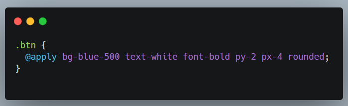
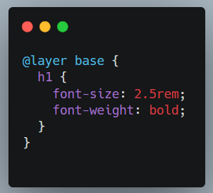

# Tailwind CSS

## Tailwind CSS nima?

Tailwind CSS dastlab 2017-yilning 1-noyabrida **Adam Wathan** va uning hamkasblari tomonidan chiqarilgan. Tailwind CSS — bu **utility-first** CSS framework bo‘lib, u sizga HTML kodingizni tez va samarali tarzda styling qilish imkonini beradi.

Tailwind'ning asosiy farqi — unda siz elementlar uchun CSS yozish o'rniga, oldindan tayyorlangan utility-klasslardan foydalanasiz. Bu klasslar ma'lum bir stilni bildiradi, masalan, `mt-4` (margin-top: 4rem) yoki `text-center` (matnni markazlash) kabi.

## Tailwind CSS'ning asosiy xususiyatlari:

1. **Utility-first** (foydali funksiyalar birinchi): Tailwind CSS foydalanuvchilarga katta komponentlar o‘rniga kichik utility-klasslarni taklif qiladi. Har bir klass muayyan bir CSS xususiyatini ifodalaydi va bu klasslar bilan oson boshqarish va sozlash imkoniyatiga ega bo‘lasiz.

   

2. **To‘liq moslashuvchanlik**: Tailwind sizga to‘liq moslashuvchanlik beradi. Siz o‘zingizga kerak bo‘lgan barcha stylingni to‘g‘ridan-to‘g‘ri HTML kodingizda utility-klasslar orqali berishingiz mumkin.

3. **Zero configuration** (noldan konfiguratsiya qilish kerak emas): Tailwind CSS bilan siz asosiy dizayn konfiguratsiyalariga muhtoj emassiz. Framework ichida tayyorlangan klasslar orqali butunlay stylingni amalga oshirishingiz mumkin.

4. **Responsive design**: Tailwind CSS responsiv dizaynni juda osonlashtiradi. Ekran o‘lchamlariga qarab ma’lum klasslarni qo‘llash imkoniyatini beradi:

   

## @apply

**Component-based dizayn**: Tailwind'da siz utility-klasslarni komponentlar orqali ham qayta ishlatishingiz mumkin. Masalan, Tailwind CSS’ning `@apply` direktivasidan foydalanib, qayta ishlatiladigan komponentlar yaratishingiz mumkin:



## @layer

Tailwind CSS'da `@layer` direktivasi sizga CSS-ni turli layerlarda (qatlamlarda) yozish imkonini beradi. Bu direktiva yordamida siz Tailwind CSS'ning mavjud qatlamlariga o‘z stylingingizni qo‘shishingiz yoki ustidan o‘zgarishlar kiritishingiz mumkin.

Tailwind CSS uchta asosiy qatlamni o‘z ichiga oladi:

1. **Base**: Bunda asosiy elementlar uchun default styling yoziladi (masalan, `body`, `h1`, `p`, va hokazo).
2. **Components**: Bu qatlamda qayta ishlatiladigan komponentlar (masalan, `button`lar, `card`lar) uchun styling mavjud.
3. **Utilities**: Tailwind CSS'da utility-klasslarni o‘z ichiga olgan asosiy qatlam. Siz bu qatlamga yangi utility-klasslar qo'shishingiz mumkin.

**Component-based dizayn**: Tailwind'da siz utility-klasslarni komponentlar orqali ham qayta ishlatishingiz mumkin. Masalan, Tailwind CSS’ning `@apply` direktivasidan foydalanib, qayta ishlatiladigan komponentlar yaratishingiz mumkin:



## peer

**Peer** — bu CSS va Tailwind CSS'da ko‘pincha ishlatiladigan konsept bo‘lib, u asosan bir elementning boshqa elementga ta'sirini ifodalash uchun ishlatiladi. Tailwind CSS'da `peer` klassi, CSS'da esa `peer` selektori yordamida bir elementning holatiga qarab boshqa elementlarning stilini o‘zgartirish mumkin.

Tailwind CSS'da `peer` klassi yordamida siz bir elementning holatini (masalan, checkbox yoki radio button) asos qilib, uning o‘zgarishi boshqa elementlarning stiliga ta'sir ko‘rsatishini amalga oshirishingiz mumkin. Bu, odatda, interaktiv holatlar va dinamik dizayn uchun ishlatiladi.


### Misollar:

1. **peer**: Checkboxga `peer` klassini berish orqali, checkbox (yoki boshqa interaktiv element) asosida stil o‘zgarishlarini ko‘rsatishingiz mumkin.
2. **peer-checked:text-green-500**: Bu holatda, `peer` klassiga ega bo‘lgan element (checkbox) belgilangan bo‘lsa, `label` elementining matn rangi yashil bo‘ladi.

## To'g'ridan-to'g'ri child elementlarni uslublash (\*-{modifier})

Tailwind CSS'da child (ichki) elementlarga to'g'ridan-to'g'ri stil berish uchun `*` belgisi bilan `modifier` (o'zgartiruvchi) qo'llash mumkin. Bu usul orqali barcha child elementlar bir xil tarzda uslublanadi, bunda faqat `parent` elementga klass qo'llanadi va child elementlar avtomatik ravishda stilni meros qilib oladi.

Misol:

```html
<div
  class="flex gap-3 my-2 *:rounded-full *:border *:border-sky-100 *:bg-[#56a1d0] *:px-2 *:py-0.5 dark:text-sky-300 dark:*:border-sky-500/15 dark:*:bg-sky-500/10"
>
  <div>BMW</div>
  <div>BYD</div>
  <div>GM</div>
  <div>Toyota</div>
</div>
```

## theme()

Tailwind CSS'da `theme()` funksiyasi ilovangizning dizayn tizimini sozlash va kengaytirish uchun ishlatiladi. Bu funksiyadan foydalangan holda, siz ranglar, oraliqlar, tipografiya va boshqa dizayn xususiyatlari uchun maxsus qiymatlarni belgilashingiz mumkin. Bunday sozlashlar `tailwind.config.js` faylida amalga oshiriladi.

### 1. Standart Tema:

Tailwind CSS bilan birga keladigan standart tema, ranglar, oraliqlar, tipografiya va boshqa xususiyatlar uchun oldindan belgilangan qiymatlarni o'z ichiga oladi.

### 2. Temani Moslashtirish:

Agar siz temani sozlashni xohlasangiz, `tailwind.config.js` faylini tahrir qilishingiz mumkin. Bu sizga standart qiymatlarni o'zgartirish, mavjud qiymatlarni kengaytirish yoki yangilarini qo'shish imkonini beradi.

### 3. Temani Kengaytirish:

`extend` xususiyatidan foydalangan holda temani kengaytirish orqali yangi utility klasslarini qo'shishingiz mumkin, bu esa eski qiymatlarni o'zgartirmaydi.

Misol:

```js
module.exports = {
  theme: {
    extend: {
      colors: {
        primary: '#1D4ED8',
        secondary: '#9333EA',
      },
    },
  },
};
```
